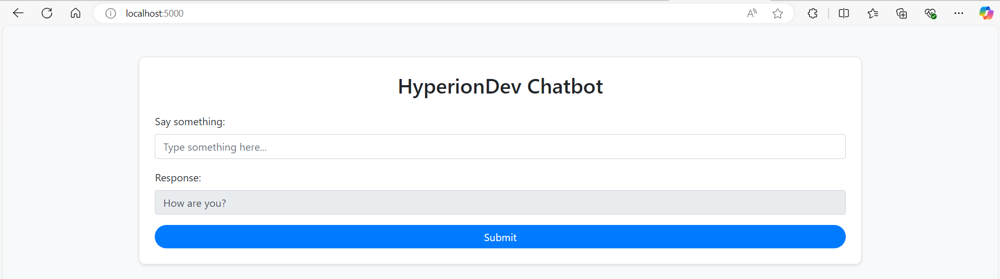

# HyperionDev Chatbot: Flask Random Response App

This is a beginner-friendly Flask web application that acts as a simple chatbot. Users can type a message, and the app responds with a random sentence from a predefined list or dynamically generated sentences using the **Wonderwords** library.

---

## 📜 **Project Overview**

The project demonstrates how to:
1. Build a **Flask-based backend** for handling user input.
2. Use a modular approach to manage random sentence generation in `sentence_selector.py`.
3. Deploy a Flask app as a web service on **Render.com**.
4. Use the **Wonderwords library** to dynamically generate sentences.
5. Create a responsive and clean web interface using **Bootstrap**.

---

## 🚀 **Getting Started Locally**

Follow the steps below to set up and run the project on your local machine.

### 1️⃣ **Prerequisites**

Make sure you have the following installed:
- Python (version 3.6 or higher)
- pip (Python package manager)

---

### 2️⃣ **Project Setup**

1. **Clone this repository**:
   ```bash
   git clone https://github.com/yourusername/hyperiondev-chatbot.git
   cd hyperiondev-chatbot
   ```

2. **Create a virtual environment** (recommended):
   ```bash
   python -m venv venv
   source venv/bin/activate   # For Windows: venv\Scripts\activate
   ```

3. **Install dependencies**:
   ```bash
   pip install -r requirements.txt
   ```

---

### 3️⃣ **Running the Application Locally**

1. Run the Flask app with Gunicorn:
   ```bash
   gunicorn app:app
   ```

2. Open your browser and go to:
   ```
   http://127.0.0.1:8000
   ```

3. Type a message in the **"Say something"** input field and click **Submit**. The app will respond with a random sentence.

---

## 🌐 **Deployment Guide on Render.com**

### Step 1: Prerequisites
1. Sign up for a free account on [Render.com](https://render.com).
2. Ensure your code is pushed to a GitHub repository.

---

### Step 2: Prepare Your Code for Deployment
1. Ensure the `requirements.txt` file is in the root directory of your project. Include **gunicorn** for deployment:
   ```bash
   Flask==3.0.0
   wonderwords==2.2.0
   gunicorn==21.2.0
   ```

2. Your app should expose the **Flask app** as `app` in `app.py`. Example:
   ```python
   from flask import Flask
   app = Flask(__name__)

   @app.route("/")
   def home():
       return "Hello from HyperionDev Chatbot!"

   if __name__ == "__main__":
       app.run()
   ```

---

### Step 3: Deploy on Render.com
1. Log in to Render and click **"New" > "Web Service"**.
2. Connect your GitHub repository containing the project.
3. In the Render setup:
   - **Build Command**:  
     ```bash
     pip install -r requirements.txt
     ```
   - **Start Command**:  
     ```bash
     gunicorn app:app
     ```
4. Choose a free plan and deploy the service.

---

### Step 4: Access Your App
Once deployed, Render will provide a live URL to access your chatbot. Visit the link to see your app in action!

---

## 🛠️ **Project Structure**

```
flask_chatbot_app/
│
├── static/
│   └── styles.css         # Custom CSS styles
│
├── templates/
│   └── index.html         # Frontend HTML file with Bootstrap
│
├── __init__.py            # Flask app initialization (optional for modularization)
├── app.py                 # Main backend Flask app
└── sentence_selector.py   # Logic for random sentence generation
```

---

## 🎨 **Screenshot**



---

## 📦 **Dependencies**

- Flask: Web framework for Python.
- Wonderwords: Library for generating random sentences.
- Gunicorn: WSGI server for deployment.
- Bootstrap: Frontend library for responsive UI.

---

## 🧑‍💻 **Contributing**

Contributions are welcome! To contribute:
1. Fork this repository.
2. Create a new branch:  
   ```bash
   git checkout -b my-new-feature
   ```
3. Make your changes and test them.
4. Commit and push to your branch:  
   ```bash
   git commit -m "Add some feature"
   git push origin my-new-feature
   ```
5. Open a Pull Request.

---

## 📄 **License**

This project is licensed under the MIT License.

---

## 🌟 **Acknowledgments**

Thanks to **HyperionDev** for inspiring this beginner-friendly project idea! 🎉
